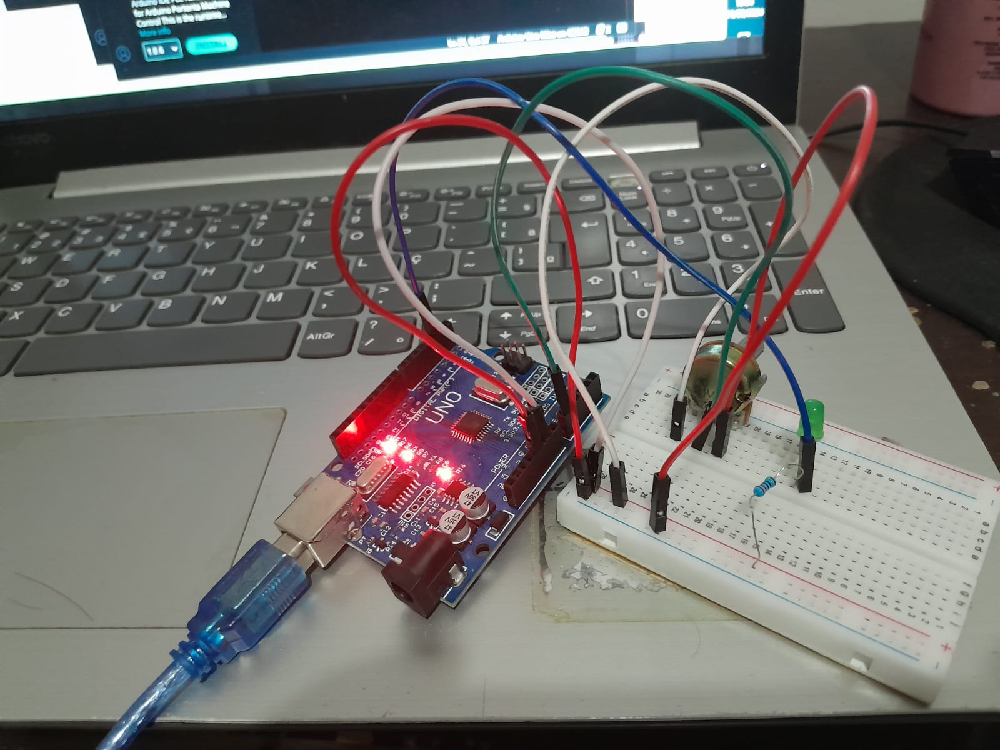

# Institution: Federal Institute of Paraíba - Cajazeiras  
# Subject: Introdução a instrumentação eletrônica  
# Teacher: Dr. Raphaell Maciel de Souza
# Academics: Henrique Sobral, Miguel Ângelo e Renan Saraiva

# Writing and reading values varied by a potentiometer.

We developed a simulation of an electronic circuit on the Tinkercad platform (Figure 1)

### Figure 1 - Circuit.

### Source: Author.

The assembly can be seen in Figure 2. Additionally, I ran the code.c on an Arduino using the Arduino IDE

### Figure 2 - Assembly of circuit.

 

### Source: Author.

The stage of writing values to a .txt file was accomplished using Arduino along with the well-known software Miners Rogers. With Miners, one can connect to the Arduino's serial port and obtain the registered values, saving them in a .txt file.

The reading process was developed in Scilab. You can review the code in the file scilab.sce.

By plotting the values, as shown in Figure 3, we can observe their distribution.

### Figure 3 - Plotting values in scilab.

### Source: Author.

## Discuss
Why are the values in the interval between 0 and 255?

This is because the values of the potentiometer range from 0 to 1023 (10 bits), which is different from Arduino's 8-bit resolution. Therefore, I transformed these values to a range of 0 to 255, representing the full range from 0 to 5V for the Arduino.

This transformation allows the LED to light up for varying values set by the potentiometer

