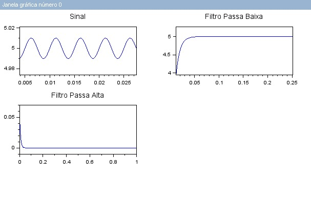
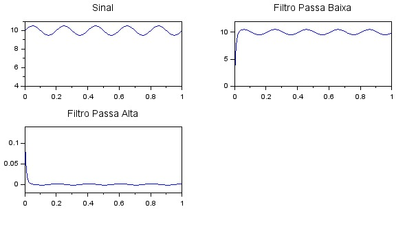
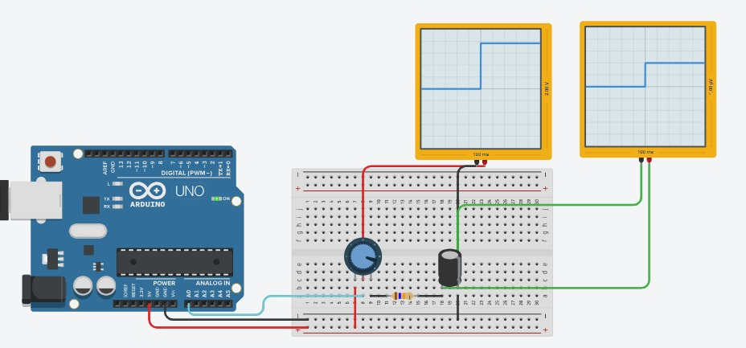
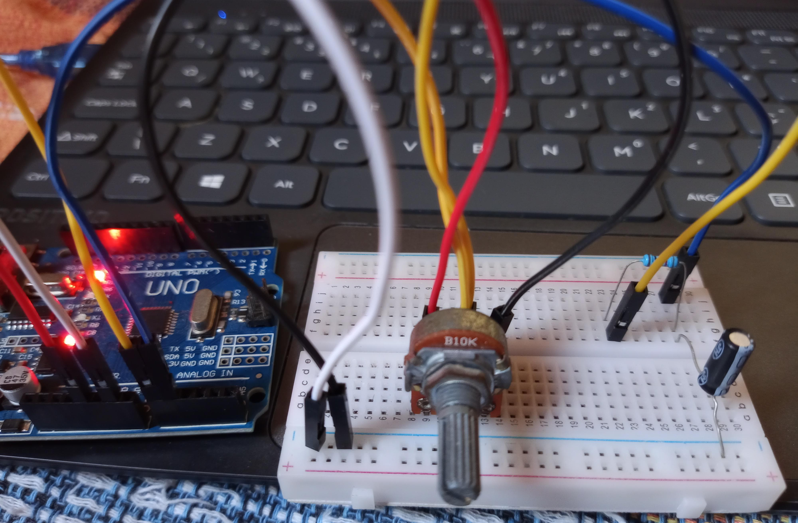

 Institution: Federal Institute of Paraíba - Cajazeiras  
Subject: Introduction to electronic instrumentation
Teacher: Dr. Raphaell Maciel de Souza

Academics: Henrique Sobral, Miguel Ângelo e Renan Saraiva

# Writing and reading values varied by a potentiometer.

We developed a simulation of an electronic circuit on the Tinkercad platform (Figure 1)

### Figure 1 - Circuit.

### Source: Authores.

The assembly can be seen in Figure 2. Additionally, I ran the code.c on an Arduino using the Arduino IDE

### Figure 2 - Assembly of circuit.

 

### Source: Authores.

The stage of writing values to a .txt file was accomplished using Arduino along with the well-known software Miners Rogers. With Miners, one can connect to the Arduino's serial port and obtain the registered values, saving them in a .txt file.

The reading process was developed in Scilab. You can review the code in the file scilab.sce.

By plotting the values, as shown in Figure 3, we can observe their distribution.

### Figure 3 - Plotting values in scilab.

### Source: Authores.

## Discuss
Why are the values in the interval between 0 and 255?

This is because the values of the potentiometer range from 0 to 1023 (10 bits), which is different from Arduino's 8-bit resolution. Therefore, I transformed these values to a range of 0 to 255, representing the full range from 0 to 5V for the Arduino.

This transformation allows the LED to light up for varying values set by the potentiometer

# Implement the high pass filter in the Scilab code that we developed in class

### Figure 4 - Plot with frequence one values in Scilab.

### Source: Authores.

### Figure 5 - Plotting values in Scilab.

### Source: Authores.

# Plotting the output of the low pass filter on the potentiometer.

To carry out this activity, the tinkcard platform was used to simulate the result generated by the low pass filter. Furthermore, it is possible to observe through the oscilloscope on the platform. See the diagram in figure 6 and circuit in figure 7. A 10k ohm potentiometer, 10k ohm resistor and 22 uF were used for the capacitor.

### Figure 6 - Plotting values in Scilab.

### Source: Authores.

### Figure 7 - Circuit assembly.

### Source: Authores.

# Updates:

The behavior, in this new commit, can be viewed on the Arduino serial, see the behavior of the low pass filter in the link below.

The [link](https://youtu.be/0FCDj9dwIl0) shows the variation of the potentiometer and the visualization of the Vc output of the low pass filter.
