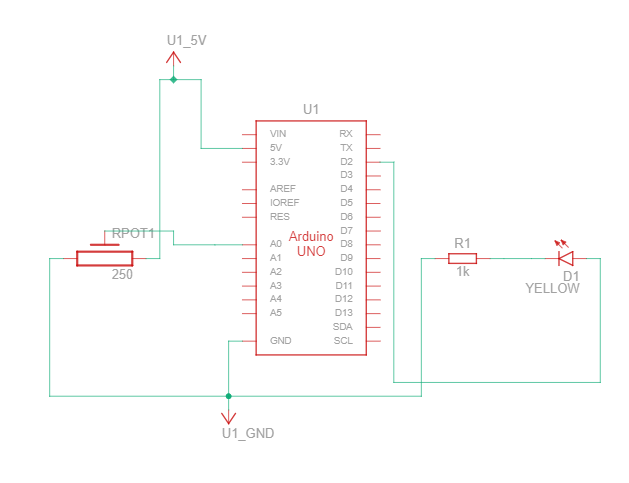
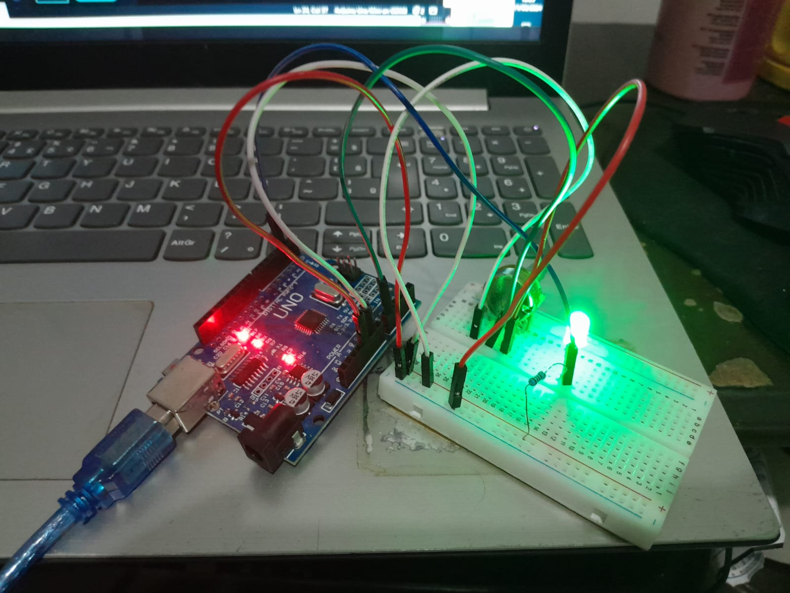
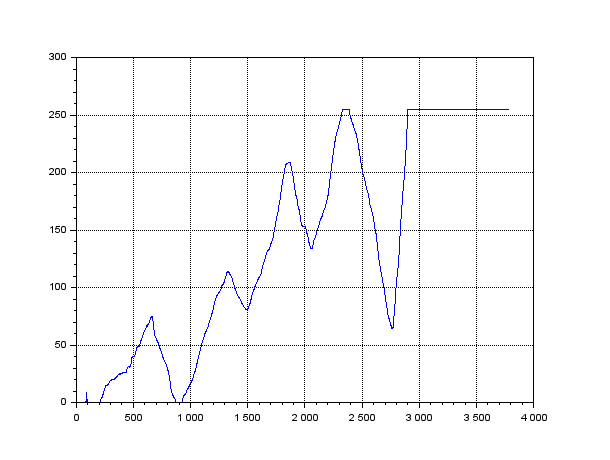

# Write and read of values varied by a potentiometer

I developed a simulation of circuit eletronic in Tinkercard plataform (Figure 1).

### Figure 1 - Circuit.

### Source: Author.

And the assembly can be seen in the figure 2. Addicionalyt, I run code.c in arduino using idle arduino.

### Figure 2 - Assembly of circuit.

 

### Source: Author.

The stage write values in file txt was used arduino + software known Miners Rogers. Where Miners can conect with serial of arduino and obtain the values registred for them saves in file txt.

The read was developed in Scilab, you are can review code in file scilab.sce.

Plotting values, we can see in figure 3.

### Figure 3 - Plotting values in scilab.

### Source: Author.

## Discuss
Why values are in interval between 0 - 255?
Because values of potentiometer are 0 - 1023 (10 bits) diferent arduino what is 8 bits. So I transform this values to 0 - 255 where represent 0 and 5V for the arduino.
That allows the led to ligh up for varying values set by the potentiometer.

